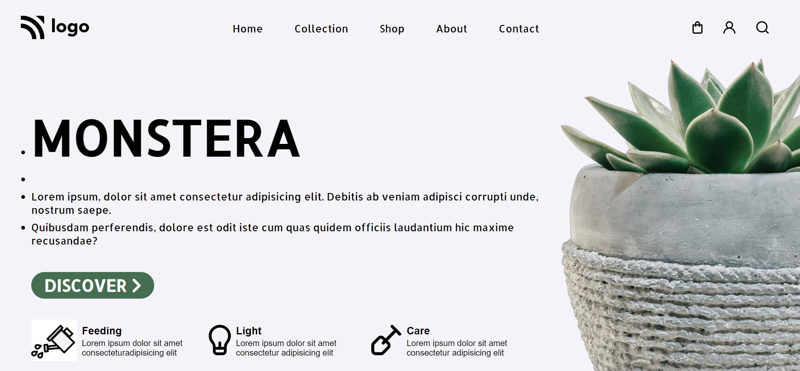

## PROJECT NAME: Plant Home Page

### **💻TECH STACK USED IN THIS PROJECT:** 
- 
- 

### **🛠WHAT I HAVE LEARNT IN THIS PROJECT:** 
- Setting an image using Absolute Positioning
- designing Buttons 
- Padding
- CSS Selectors
- CSS Flex-box

### **⌛TIME TAKEN TO COMPLETE THIS PROJECT:** 
- I have taken 2 hours to complete this project.

### **👀HOW MY PROJECT LOOKS LIKE:**

### 💻This Project looks good only in **Laptop Screen**(Not Responsive)

### **🚀LIVE LINK:**
-  This project is hosted on **Netlify**.You can Check it live using below link: 
-  [Project Live Link !](https://631c5b54775c34181e95c7b3--eloquent-malasada-565f59.netlify.app/)

